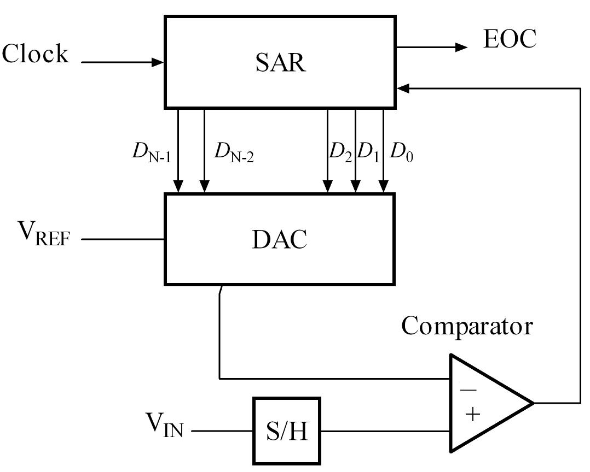
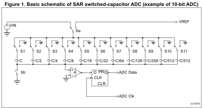

# ADC
ADC: Analog-to-Digital Converter, 模数转换器.

## SAR
SAR: Successive Approximation Register, 逐次逼近型 ADC.

基本思想：通过一个 DAC 产生反馈电压，与输入电压比较，从 MSB 到 LSB 逐位确定数字码，使 DAC 输出不断逼近输入电压。

$$
V_\text{cmp}=V_\text{DAC}(D)-V_\text{IN}
$$

  

优点: 功耗低, 面积小.

缺点: 速度受逐次比较和 DAC 建立限制; 输入驱动要求较高; 比较器失调和电容失配影响精度.

定义 $V_H=V_\text{REF+}$, $V_L=V_\text{REF-}$, $V_\text{REF}=V_H-V_L$.

在某些 ADC 芯片中, $V_L = V_\text{SS} = 0$, $V_\text{REF} = V_H = V_\text{DD}$.

### 数字码

输出码 $D_\text{out}$ 是转换结束时逐次逼近寄存器中锁存的 $n$ 位二进制码.

设 $n$ 位数字码为:

$$
D = (b_{n-1}b_{n-2}\cdots b_0)_2 = \sum_{j=0}^{n-1} b_j2^j,\quad b_i \in \{0,1\} \\
D \in \{0,1,\dots,2^n-1\}
$$

其中 $b_{n-1}$ 为最高有效位 (MSB), $b_{0}$ 为最低有效位 (LSB).

该 SAR ADC 的分辨率为 $n$ 位.

对任意数字码 $D$, 定义其理想 DAC 输出:

$$
V_\text{DAC}(D)=V_L+\frac{D}{2^n}V_\text{REF}
$$

转换过程中:
- $D_\text{cur}$: 当前已确定码;
- $D_\text{trial}$: 当前试探码;
- $D_\text{out}$: 转换结束最终锁存输出.

在理想单端 SAR ADC 中, 若采用截断式定义, 且满足 $V_L \le V_\text{IN} < V_H$ 时, 最终输出 $D_\text{out}$ 是满足下式的唯一整数:

$$
D\,V_\text{LSB} \le V_\text{IN} - V_L < (D+1)\,V_\text{LSB}
$$

量化误差为:

$$
0 \le V_\text{IN}-V_\text{DAC}(D_\text{out}) < V_\text{LSB}
$$

其中 $V_\text{LSB} = (V_H-V_L) / 2^n$.

### SAR 逐次逼近
初始化: $D_\text{cur} = 0$, $k=1$. $k \in \{ 1,2,\dots,n \}$.

从 MSB 到 LSB 逐位确定.  
第 $k$ 位权重为 $2^{n-k}$.

假设 $[1,k-1]$ 位已确定, 现试探第 $k$ 位.

$$
D_\text{trial}=D_\text{cur}+2^{n-k}
$$

获取 $V_\text{cmp}(D_\text{trial})$, 并送入比较器.
- 若 $V_\text{cmp}(D_\text{trial}) \le 0$, 则 $D_\text{cur} \larr D_\text{trial}$.
- 若 $V_\text{cmp}(D_\text{trial}) > 0$, 则 $D_\text{cur}$ 保持不变.

试探下一位 $k \larr k+1$, 或结束.

最终输出:

$$
D_\text{out} = D_\text{cur} = \begin{cases}
0, & V_\text{IN} < V_L \\
\begin{gathered}
\left\lfloor 2^n \frac{V_\text{IN}-V_L}{V_\text{REF}} \right\rfloor
\end{gathered}, & V_L \le V_\text{IN} < V_H\\
2^n-1, & V_\text{IN} \ge V_H
\end{cases}
$$

### CDAC
常用电容型 DAC (电荷重分配 DAC)。无静态功耗，CMOS 集成简单，可以与采样保持电路合并。

典型结构 (以 STM32 ADC 为例):

  

工作原理: 电荷守恒.

以 $n$ 位单端电荷重分配 DAC 为例, 电容值取:

$$
C_i = \frac{1}{2^i}C_\text{total},\quad i\in[1,n]\\
C_{n+1} = \frac{1}{2^n}C_\text{total}
$$

设电容阵列总电容为 $C_\text{total}$, 总电荷恒为 $Q_\text{total}$.

定义 $Q_i$ 为 $C_i$ 的上极板电荷, 即 $Q_i = C_i (V_\text{top} - V_\text{bottom})$.

**采样**时, 所有下极板接 $V_\text{IN}$, 上极板接 $V_L$.

$$
Q_\text{total} = C_\text{total}(V_L-V_\text{IN})
$$

**保持**时, 所有下极板接 $V_L$; 上极板浮空, 电压为 $2V_L-V_\text{IN}$.

**逐次逼近**过程中:

设数字码为 $D$ 时, 下极板连接 $V_H$ 的总电容为 $C_H(D)$, 连接 $V_L$ 的总电容为 $C_L(D)$; 上极板电压为 $V_\text{top}(D)$.

对当前 $D$, $C_i\, (i \in [1,n])$ 对应的位 $b_{n-i} = 1$ 时下极板接 $V_H$, 否则接 $V_L$; $C_{n+1}$ 始终接 $V_L$. 于是:

$$
C_H(D) = \sum_{i:b_{n-i}=1}C_i = \frac{D}{2^n}C_\text{total}\\
C_L(D) = C_\text{total} - C_H(D)
$$

$$
Q_\text{total} = C_H(D) \cdot (V_\text{top}(D)-V_H) + C_L(D) \cdot (V_\text{top}(D)-V_L)
$$

化简得

$$
V_\text{top}(D)-V_L = \frac{D}{2^n} V_\text{REF} - (V_\text{IN} - V_L)\\
V_\text{cmp}(D) = V_\text{top}(D)-V_L = V_\text{DAC}(D) - V_\text{IN}
$$

最终比较器的输入为 $V_\text{top}(D)$ 与 $V_L$, 而非 $V_\text{DAC}(D)$ 与 $V_\text{IN}$.
