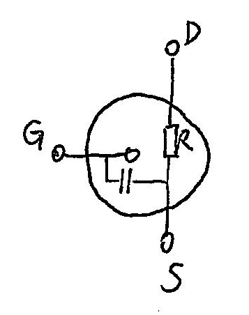
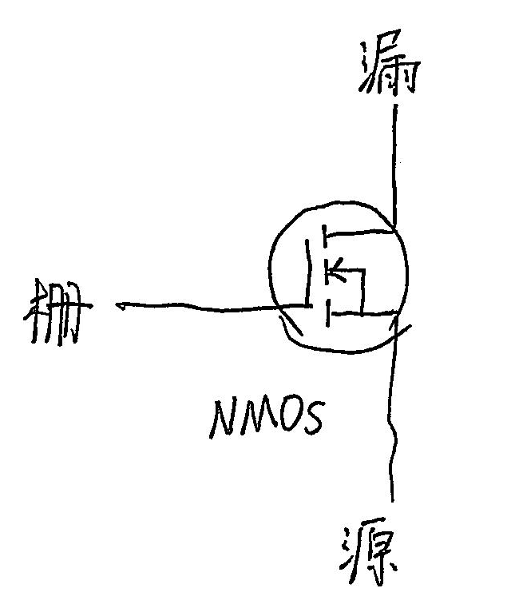
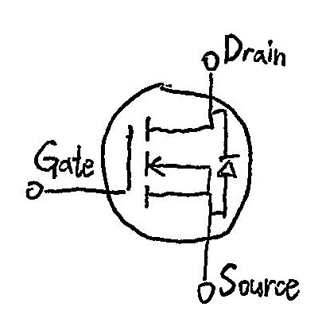
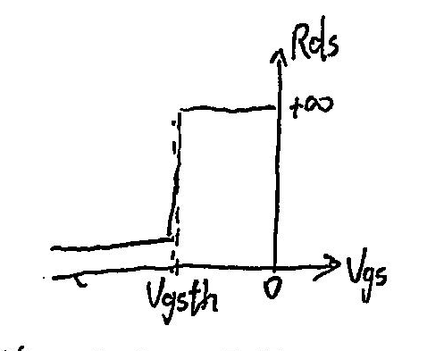
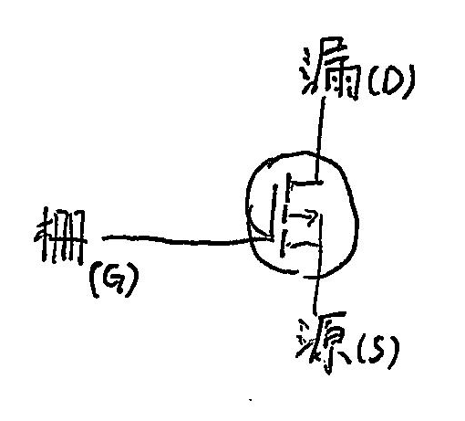
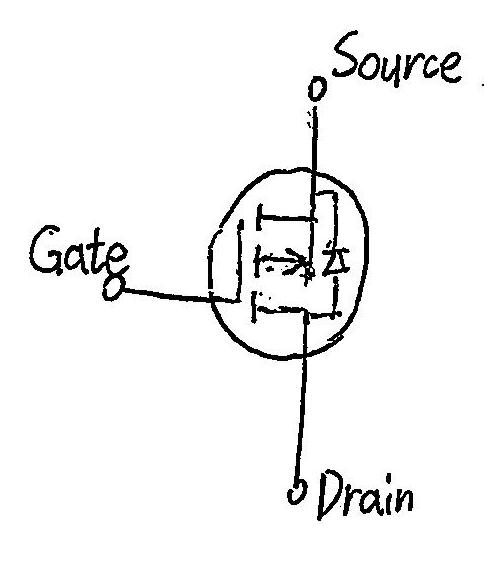

# 场效应管

供速查用，相当不规范。不可作学习用途。

## 绝缘栅型 (IGFET) > 金属-氧化物-半导体场效应管 (MOSFET)

以下均为增强型。

- 栅极 (Gate)
- 漏极 (Drain)
- 源极 (Source)

等效模型：受 $V_{GS}$ 控制的 $R_{DS}$。

- $V_{GS} = V_G - V_S$
- $R_{DS\text{(on)}}$：MOS 管导通时，D 与 S 之间的电阻。MOS 管越贵，值一般越小。
- $C_{GS}$：G 与 S 之间的寄生电容，一般与 $R_{DS\text{(on)}}$ 负相关。

电气符号理解：“←”、“→”符号标记电子的流动方向。

注意体二极管。

### NMOS

### PMOS

### 用法
源极连电源轨，漏极连元件，栅极串联电阻连 GPIO。

- NMOS 源极 (S) 置于 GND，作低边开关，控制功率器件。
- PMOS 源极 (S) 置于 VCC，作高边开关，控制 IC。
