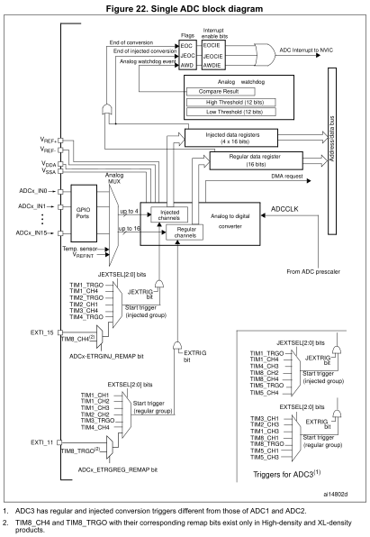
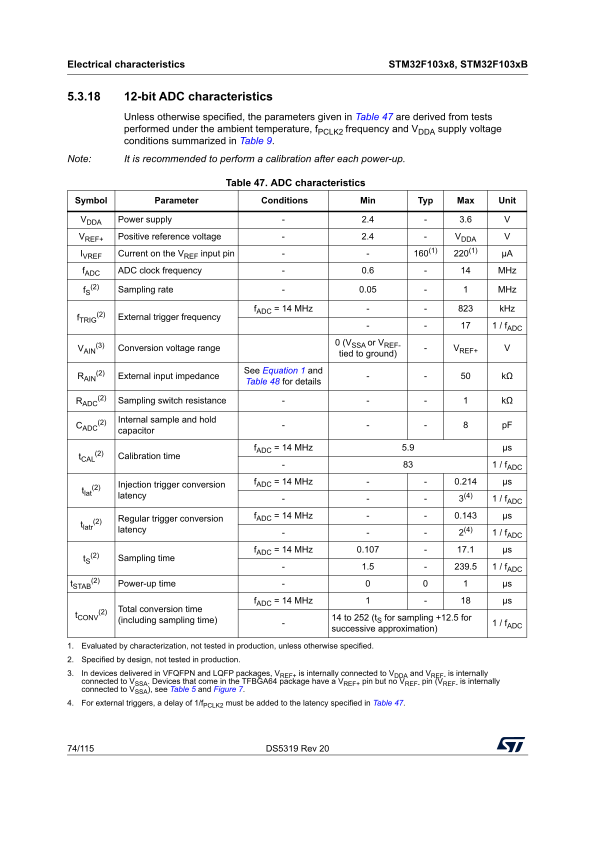

# ADC

以 **STM32F103C8T6** 芯片为例, 主要记录 Regular group.

个人学习笔记，不保证正确。请以 ST 手册上的内容为准。

参考资料：
- [RM0008 - ST](https://www.st.com/resource/en/reference_manual/rm0008-stm32f101xx-stm32f102xx-stm32f103xx-stm32f105xx-and-stm32f107xx-advanced-armbased-32bit-mcus-stmicroelectronics.pdf)

## 基础信息
- 12-bit ADC
- 逐次逼近型模数转换器 (SAR ADC)
- 18 个通道 = 16 外部 + 2 内部. STM32F103C8T6 可用 10 个外部通道.
- ADCCLK: 由 PCLK2 经预分频器产生, 频率**不得超过 14MHz**

## 主要特性

- 12 位分辨率
- 在转换结束、注入转换结束和模拟看门狗事件时产生中断
- 单次 (single) 和连续 (continous) 转换模式
- 用于自动转换通道 0 到通道 n 的扫描 (scan) 模式
- 自校准
- 具有内置数据一致性的数据对齐
- 逐通道可编程采样时间
- 规则转换和注入转换均可选择外部触发
- 间断 (discontinous) 模式
- 双重 (dual) 模式（在具有 2 个或更多 ADC 的器件上）
- ADC 转换时间：
  - STM32F103xx 增强型器件：在 72 MHz 时为 1.17 μs<!-- 在 56 MHz 时为 1 μs（在 72 MHz 时为 1.17 μs） -->
  <!--
  - STM32F101xx 基本型器件：在 28 MHz 时为 1 μs（在 36 MHz 时为 1.55 μs）
  - STM32F102xx USB 基本型器件：在 48 MHz 时为 1.2 μs
  - STM32F105xx 和 STM32F107xx 器件：在 56 MHz 时为 1 μs（在 72 MHz 时为 1.17 μs）
  -->
- ADC 电源要求：2.4 V 至 3.6 V
- ADC 输入范围：VREF- ≤ VIN ≤ VREF+
- 在规则 (regular) 通道转换期间产生 DMA 请求

<div align="center">
  
</div>

<!-- 注：如果 VREF- 可用（取决于封装），则必须将其连接到 VSSA。 -->

<div align="center">
  
</div>

## SAR

$$
t_\textsf{CONV} = t_\textsf{S} + 12.5 \cdot \frac{1}{f_\textsf{ADC}}
$$

$t_\textsf{S}$ 采样; $\frac{12.5}{f_\textsf{ADC}}$ 保持, 逐位逼近. 原理见 [SAR ADC](../electronic/adc.md#sar).

> **AN2834 Rev 10 §2.1 SAR ADC internal structure**
> 
> The ADC embedded in STM32 microcontrollers uses the SAR (successive approximation register) principle, by which the conversion is performed in several steps. The number of conversion steps is equal to the number of bits in the ADC converter. Each step is driven by the ADC clock. Each ADC clock produces one bit from result to output. The ADC internal design is based on the switched-capacitor technique.

## ADC on-off control
置 ADC_CR2:ADON=1

相关寄存器: [ADC_CR2.ADON](#adc_cr2adon).

## ADC clock
PCLK2 (APB2 clock) -> ADC Prescaler -> ADCCLK

最高 14MHz.

## Channel selection

16 个复用通道, 分规则组 (regular group) 和注入组 (injected group), 通道顺序任意.

- 规则组 ≤ 16, 顺序由 ADC_SQRx 选择.  
- 注入组 ≤ 4, 顺序由 ADC_JSQR 选择.`

若在转换期间修改 ADC_SQRx 或 ADC_JSQR, 则当前转换复位, 并 (由硬件) 向 ADC 发送新的启动脉冲.

相关寄存器: [ADC_SQR1.L](#adc_sqr1l), [ADC_SQRx.SQx](#adc_sqrxsqx), ADC_JSQR.JL, ADC_JSQR.JSQx.

> **RM0008 Rev 21 §11.3.3 Channel selection**
> 
> There are 16 multiplexed channels. It is possible to organize the conversions in two groups: regular and injected. A group consists of a sequence of conversions which can be done on any channel and in any order. ...
> 
> - The regular group is composed of up to 16 conversions. The regular channels and their order in the conversion sequence must be selected in the ADC_SQRx registers. The total number of conversions in the regular group must be written in the L[3:0] bits in the ADC_SQR1 register.
> - The injected group is composed of up to 4 conversions. The injected channels and their order in the conversion sequence must be selected in the ADC_JSQR register. The total number of conversions in the injected group must be written in the L[1:0] bits in the ADC_JSQR register.
> 
> If the ADC_SQRx or ADC_JSQR registers are modified during a conversion, the current conversion is reset and a new start pulse is sent to the ADC to convert the new chosen group.

## Single conversion mode

单次转换模式：ADC 执行一次转换。

ADC_CR2:CONT=0 时：
- 置 ADC_CR2:ADON=1 启动 (仅 regular channel).
- 外部触发启动 (regular / injected channel).

转换完成后：
- Regular channel: 数据写入 ADC_DR；置 ADC_SR:EOC=1；产生中断。
- Injected channel：数据写入 ADC_DRJ1；产生中断。

随后 ADC 停止。

相关寄存器: [ADC_SR.EOC](#adc_sreoc).

> **RM0008 Rev 21 §11.3.4 Single conversion mode**
> 
> In Single conversion mode the ADC does one conversion. This mode is started either by setting the ADON bit in the ADC_CR2 register (for a regular channel only) or by external trigger (for a regular or injected channel), while the CONT bit is 0.
> 
> Once the conversion of the selected channel is complete:
> - If a regular channel was converted:
>   - The converted data is stored in the 16-bit ADC_DR register
>   - The EOC (End Of Conversion) flag is set
>   - and an interrupt is generated if the EOCIE is set.
> - If an injected channel was converted:
>   - The converted data is stored in the 16-bit ADC_DRJ1 register
>   - The JEOC (End Of Conversion Injected) flag is set
>   - and an interrupt is generated if the JEOCIE bit is set.
> 
> The ADC is then stopped.

## Continous conversion mode

连续转换模式：ADC 完成一次转换后，立即开始下一次。

ADC_CR2:CONT=1, 其余同 Single conversion mode.

> **RM0008 Rev 21 §11.3.5 Continuous conversion mode**
> 
> In continuous conversion mode ADC starts another conversion as soon as it finishes one. This mode is started either by external trigger or by setting the ADON bit in the ADC_CR2 register, while the CONT bit is 1.
> 
> After each conversion:
> - If a regular channel was converted:
>   - The converted data is stored in the 16-bit ADC_DR register
>   - The EOC (End Of Conversion) flag is set
>   - An interrupt is generated if the EOCIE is set.
> - If an injected channel was converted:
>   - The converted data is stored in the 16-bit ADC_DRJ1 register
>   - The JEOC (End Of Conversion Injected) flag is set
>   - An interrupt is generated if the JEOCIE bit is set.

## Scan mode

扫描模式：扫描选中的所有通道。每个通道转换一次，并自动切换到下一通道。若 ADC_CR2:CONT=1，则在最后一个选定通道后从第一个选定通道重新开始。

软件置 ADC_CR1:SCAN=1 开启.

- 规则通道 (regular):
  - 序列寄存器为 ADC_SQRx;
  - 置 ADC_CR2:DMA=1, 数据通过 DMA 搬运到内存中.
- 注入通道 (injected):
  - 序列寄存器为 ADC_JSQR;
  - 数据存储在 ADC_JDRx 中.

相关寄存器: ADC_CR1.SCAN, [ADC_SMPRx.SMPx](#adc_smprxsmpx), [ADC_SQR1.L](#adc_sqr1l), [ADC_SQRx.SQx](#adc_sqrxsqx), ADC_JSQR.JL, ADC_JSQR.JSQx.

> **RM0008 Rev 21 §11.3.8 Scan mode**
> 
> This mode is used to scan a group of analog channels.
> 
> Scan mode can be selected by setting the SCAN bit in the ADC_CR1 register. Once this bit is set, ADC scans all the channels selected in the ADC_SQRx registers (for regular channels) or in the ADC_JSQR (for injected channels). A single conversion is performed for each channel of the group. After each end of conversion the next channel of the group is converted automatically. If the CONT bit is set, conversion does not stop at the last selected group channel but continues again from the first selected group channel.
> 
> When using scan mode, DMA bit must be set and the direct memory access controller is used to transfer the converted data of regular group channels to SRAM after each update of the ADC_DR register.
> 
> The injected channel converted data is always stored in the ADC_JDRx registers.

## 校准

建议每次上电后都执行一次校准。在开始校准之前，ADC 必须已处于上电状态 (ADC_CR2:ADON=1) 至少两个 ADC 时钟周期。

校准写 ADC_CR2:CAL=1。校准完成后 ADC_CR2:CAL 被硬件复位，校准码写入 ADC_DR。

> **RM0008 Rev 21 §11.4 Calibration**
> 
> The ADC has an built-in self calibration mode. Calibration significantly reduces accuracy errors due to internal capacitor bank variations. During calibration, an error-correction code (digital word) is calculated for each capacitor, and during all subsequent conversions, the error contribution of each capacitor is removed using this code.
> 
> Calibration is started by setting the CAL bit in the ADC_CR2 register. Once calibration is over, the CAL bit is reset by hardware and normal conversion can be performed. It is recommended to calibrate the ADC once at power-on. The calibration codes are stored in the ADC_DR as soon as the calibration phase ends.
> 
> Note:
> - It is recommended to perform a calibration after each power-up.
> - Before starting a calibration, the ADC must have been in power-on state (ADON bit = ‘1’) for at least two ADC clock cycles.

## 温度传感器

内置的温度传感器，可测量芯片结温。

温度传感器输出电压与温度呈线性关联，以 STM32F103C8T6 为例 (典型值)：

$$
U(t)=1430\,\mathrm{mV} - 4.3\,\mathrm{mV}/^\circ\mathrm{C} \cdot (t - 25\,{}^\circ\mathrm{C})
$$

通过输出电压反解温度：

$$
t=\frac{1430\,\mathrm{mV} - U(t)}{4.3\,\mathrm{mV}/^\circ\mathrm{C}} + 25\,{}^\circ\mathrm{C}
$$

采样时间 ≥ 17.1 μs.

> **RM0008 Rev 21 §11.10 Temperature sensor**
> 
> ... The temperature sensor output voltage changes linearly with temperature. ... The internal temperature sensor is more suited to applications that detect **temperature variations** instead of absolute temperatures. ...
> 
> **Reading the temperature**
> 
> To use the sensor:
> 1. Select the ADCx_IN16 input channel.
> 2. Select a sample time of 17.1 μs
> 3. Set the TSVREFE bit in the ADC control register 2 (ADC_CR2) to wake up the temperature sensor from power down mode.
> 4. Start the ADC conversion by setting the ADON bit (or by external trigger).
> 5. Read the resulting V<sub>SENSE</sub> data in the ADC data register
> 6. Obtain the temperature using the following formula:
> 
> Temperature (in °C) = {(V<sub>25</sub> - V<sub>SENSE</sub>) / Avg_Slope} + 25.  
> Where,  
> V<sub>25</sub> = V<sub>SENSE</sub> value for 25° C and  
> Avg_Slope = Average Slope for curve between Temperature vs. V<sub>SENSE</sub> (given in mV/° C or μV/ °C).  
> Refer to the Electrical characteristics section for the actual values of V<sub>25</sub> and Avg_Slope.
> 
> Note: The sensor has a startup time after waking from power down mode before it can output V<sub>SENSE</sub> at the correct level. The ADC also has a startup time after power-on, so to minimize the delay, the ADON and TSVREFE bits should be set at the same time.


> **DS5319 Rev 20 §5.3.19 Temperature sensor characteristics**
> 
> Table 51. TS characteristics
> 
> | Symbol | Parameter | Min | Typ | Max | Unit |
> | :--: | :--- | :--: | :--: | :--: | :--: |
> | T<sub>L</sub><sup>(1)</sup> | V<sub>SENSE</sub> linearity with temperature | - | ±1 | ±2 | °C |
> | Avg_Slope<sup>(1)</sup> | Average Slope | 4.0 | 4.3 | 4.6 | mV/°C |
> | V<sub>25</sub><sup>(1)</sup> | Voltage at 25°C | 1.34 | 1.43 | 1.52 | V |
> | t<sub>START</sub><sup>(2)</sup> | Startup time | 4 | - | 10 | μs |
> | T<sub>S_TEMP</sub><sup>(3)(2)</sup> | ADC sampling time when reading the temperature | - | - | 17.1 | μs |
> 
> 1. Evaluated by characterization, not tested in production, unless otherwise specified.
> 2. Specified by design, not tested in production.
> 3. Shortest sampling time can be determined in the application by multiple iterations.

## 嵌入式基准电压

V<sub>REFINT</sub> = 1.20V (典型值), 采样时间 ≥ 17.1 μs.

> **DS5319 Rev 20 §5.3.4 Embedded reference voltage**
> 
> The parameters given in Table 12 are derived from tests performed under ambient temperature and VDD supply voltage conditions summarized in Table 9.
> 
> Table 12. Embedded internal reference voltage
> | Symbol | Parameter | Conditions | Min | Typ | Max | Unit |
> | :--: | :--- | :--: | :--: | :--: | :--: | :--: |
> | V<sub>REFINT</sub> | Internal reference voltage | -40°C<T<sub>A</sub><+105°C | 1.16 | 1.20 | 1.26 | V |
> | V<sub>REFINT</sub> | Internal reference voltage | -40°C<T<sub>A</sub><+85°C | 1.16 | 1.20 | 1.24 | V |
> | T<sub>S_vrefint</sub><sup>(1)</sup> | ADC sampling time when reading the internal reference voltage | - | - | 5.1 | 17.1<sup>(2)</sup> | μs |
> | V<sub>REFINT</sub><sup>(2)</sup> | Internal reference voltage spread over the temperature range | V<sub>DD</sub>=3V±10mV | - | - | 10 | mV |
> | T<sub>Coeff</sub><sup>(2)</sup> | Temperature coefficient | - | - | - | 100 | ppm/°C |
> 1. Shortest sampling time can be determined in the application by multiple iterations.
> 2. Specified by design, not tested in production.

## DMA
TODO.

## 寄存器
### ADC_SR.EOC
读 ADC_DR 时，硬件自动清零；也可由软件清零。

> **RM0008 Rev 21 §11.12.1 ADC status register (ADC_SR)**
> 
> Bit 1 **EOC**: End of conversion
> 
> This bit is set by hardware at the end of a group channel conversion (regular or injected). It is cleared by software or by reading the ADC_DR.
> 
> 0: Conversion is not complete  
> 1: Conversion complete

HAL 库中，`HAL_ADC_IRQHandler` 对 EOC 进行了软件清零。

### ADC_CR2.ADON

由软件控制:
- 原为 0 时, 写 1: 唤醒 ADC.
- 已为 1 时, 写 1: 启动一次转换.
- 写 0: 停止并进入 power down.

> **RM0008 Rev 21 §11.12.3 ADC control register 2 (ADC_CR2)**
> 
> Bit 0 ADON: A/D converter ON / OFF
> 
> This bit is set and cleared by software. If this bit holds a value of zero and a 1 is written to it then it wakes up the ADC from Power Down state.
> 
> Conversion starts when this bit holds a value of 1 and a 1 is written to it. The application should allow a delay of tSTAB between power up and start of conversion. Refer to Figure 23.
> 
> 0: Disable ADC conversion/calibration and go to power down mode.  
> 1: Enable ADC and to start conversion.
> 
> Note: If any other bit in this register apart from ADON is changed at the same time, then conversion is not triggered. This is to prevent triggering an erroneous conversion.

### ADC_SMPRx.SMPx

逐通道采样时间.

> **RM0008 Rev 21 §11.12.4 ADC sample time register 1 (ADC_SMPR1)**
> 
> Bits 23:0 SMPx[2:0]: Channel x Sample time selection
> 
> These bits are written by software to select the sample time individually for each channel. During sample cycles channel selection bits must remain unchanged.
> 
> 000: 1.5 cycles  
> 001: 7.5 cycles  
> 010: 13.5 cycles  
> 011: 28.5 cycles  
> 100: 41.5 cycles  
> 101: 55.5 cycles  
> 110: 71.5 cycles  
> 111: 239.5 cycles
> 
> Note:  
> ADC1 analog inputs Channel16 and Channel17 are internally connected to the temperature sensor and to VREFINT, respectively.  
> ADC2 analog inputs Channel16 and Channel17 are internally connected to VSS.  
> ADC3 analog inputs Channel9, Channel14, Channel15, Channel16 and Channel17 are connected
> to VSS.

### ADC_SQR1.L

规则组 (regular group) 扫描序列长度.

> **RM0008 Rev 21 §11.12.9 ADC regular sequence register 1 (ADC_SQR1)**
> 
> Bits 23:20 **L**[3:0]: Regular channel sequence length
> 
> These bits are written by software to define the total number of conversions in the regular channel conversion sequence.
> 
> 0000: 1 conversion  
> 0001: 2 conversions  
> ...  
> 1111: 16 conversions

### ADC_SQRx.SQx

规则组 (regular group) 扫描序列.

> **RM0008 Rev 21 §11.12.9 ADC regular sequence register 1 (ADC_SQR1)**
> 
> Bits 19:15 **SQ16**[4:0]: 16th conversion in regular sequence
> 
> These bits are written by software with the channel number (0..17) assigned as the 16th in the conversion sequence.

## CubeMX 配置

以 STM32F103C8T6 为例。

```
Analog > ADCx > ADCx Mode and Configuration

- Mode
  - [ ] INx
  - [ ] Temperature Sensor Channel
  - [ ] Vrefint Channel
  - EXTI Conversion Trigger: Disabled / Injected Trigger / Regular Trigger / Injected and Regular Trigger
- Configuration
  - Parameter Settings
    - ADCs_Common_Settings
      - Mode: Independent mode / Dual combined regular simultaneous + injected simultaneous mode / Dual regular simultaneous + alternate trigger mode / Dual combined injected simultaneous + fast interleaved mode (delay between ADC sampling phases: 7 ADC clock cycles) / Dual combined injected simultaneous + slow interleaved mode (delay between ADC sampling phases: 14 ADC clock cycles) / Dual injected simultaneous mode only / Dual regular simultaneous mode only / Dual fast interleaved mode only (delay between ADC sampling phases: 7 ADC clock cycles) / Dual slow interleaved mode only (delay between ADC sampling phases: 14 ADC clock cycles) / Dual alternate trigger mode only
    - ADC_Settings
      - Data Alignment: Right alignment / Left alignment  -> ADC_CR2.ALIGN
      - Scan Conversion Mode: Disabled / Enabled  -> ADC_CR1.SCAN
      - Continous Conversion Mode: Disabled / Enabled  -> ADC_CR2.CONT
      - Discontinous Conversion Mode: Disabled / Enabled
    - ADC_Regular_ConversionMode
      - Enable Regular Conversions: Enable / Disable
      - Number Of Conversion: x  -> ADC_SQR1.L[3:0]
      - External Trigger Conversion Source: Regular Conversion launched by software / Timer x Capture Compare x event / Timer x Trigger Out event / EXTI Line x
      - Rank x
        - Channel: Channel x  -> ADC_SQRx.SQx[4:0]
        - Sampling Time: x Cycles  -> ADC_SMPRx.SMPx[2:0]
    - ADC_Injected_ConversionMode
      - Enable Injected Conversions: Disable / Enable
      - Number Of Conversion: x  -> ADC_JSQR.JL[1Q:0]
      - External Trigger Conversion Source: Injected Conversion launched by software / Timer x Capture Compare x event / Timer x Trigger Out event / EXTI Line x
      - Rank x
        - Channel: Channel x  -> ADC_JSQR.JSQx[4:0]
        - Sampling Time: x Cycles  -> ADC_SMPRx.SMPx[2:0]
        - Injected Offset: x
    - WatchDog
      - Enable Analog WatchDog Mode: [ ]
  - NVIC Settings
  - DMA Settings
    - DMA Request, Channel, Direction, Priority
    - DMA Request Settings
      - Mode: Normal / Circular
      - Peripheral:
        - Increment Address: [ ]
        - Data Width: Half Word
      - Memory:
        - Increment Address: [x]
        - Data Width: Half Word
  - GPIO Settings
```

> 铃兰火腿烤格子 from BiliBili:  
> stm32f4使用adc持续转换+dma存储数据需要开启这个: Analog > ADC1 > ADC1 Mode and Configuration > Configuration > Parameter Settings > ADC_Settings > DMA Continous Requests: Enabled.  
> [BV1QNz6YuE2x](https://www.bilibili.com/video/BV1QNz6YuE2x/) 评论区, 2025年6月20日 广东

## HAL 库用法
```cpp
HAL_StatusTypeDef HAL_ADCEx_Calibration_Start(ADC_HandleTypeDef* hadc);  // 执行内部自校准

HAL_StatusTypeDef HAL_ADC_Start(ADC_HandleTypeDef* hadc);  // 启动 ADC 规则通道 (regular channel) 转换
HAL_StatusTypeDef HAL_ADC_Start_IT(ADC_HandleTypeDef* hadc);  // 启动, 并使能转换完成 (EOC) 中断
HAL_StatusTypeDef HAL_ADC_Start_DMA(ADC_HandleTypeDef* hadc, uint32_t* pData, uint32_t Length);  // ?

HAL_StatusTypeDef HAL_ADC_PollForConversion(ADC_HandleTypeDef* hadc, uint32_t Timeout);  // 轮询方式等待 ADC 转换完成

// ADC 规则组 (regular group) 转换完成回调函数
// Start_IT 启动时, 为 EOC 中断回调;
// Start_DMA 启动时, 为 DMA 传输完成中断回调.
__weak void HAL_ADC_ConvCpltCallback(ADC_HandleTypeDef* hadc) {}

uint32_t HAL_ADC_GetValue(ADC_HandleTypeDef* hadc);  // 读取 ADC_DR 的值
```
