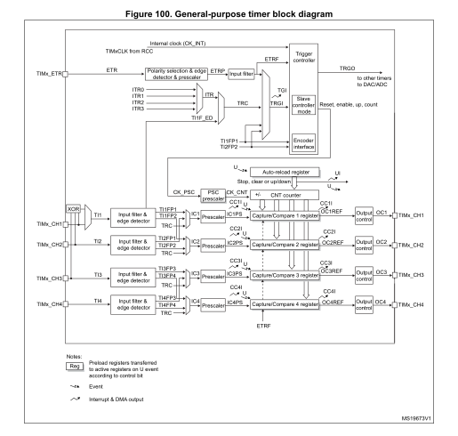

# 定时器

<!--
[AN4013: Introduction to timers for STM32 MCUs - STMicroelectronics](https://www.st.com/resource/en/application_note/an4013-introduction-to-timers-for-stm32-mcus-stmicroelectronics.pdf)
-->

## 基本定时器 Basic timers
### 计数
时钟信号 -> 预分频器 -> 计数器

预分频器 / 计数器 容量均为 16bit。

如需对输入时钟进行 $n$ 分频 $(n \le 65536)$，则设置 预分频器(prescaler) 为 $n-1$。

### 定时器更新中断
如需每 $m$ 个脉冲触发一次中断 $(m \le 65536)$，则设置 自动重装载寄存器(TIMx_ARR) 为 $m-1$。

计数器 CNT 的循环是：0,1,2,...,ARR

### 影子寄存器
默认关闭。
- 关闭时，若在运行过程中调整 自动重装载寄存器 的值，可能会错过重装载。
- 开启后，预分频寄存器 及 自动重装载寄存器 的变更会在下个计数周期生效。

### HAL 库用法
```cpp
HAL_StatusTypeDef HAL_TIM_Base_Start(TIM_HandleTypeDef *htim); // 启用定时器基础计时功能
HAL_StatusTypeDef HAL_TIM_Base_Start_IT(TIM_HandleTypeDef *htim); // 启用定时器基础计时功能，并使能更定时器新中断

__weak void HAL_TIM_PeriodElapsedCallback(TIM_HandleTypeDef *htim) {} // 定时器更新中断回调函数

#define __HAL_TIM_GET_COUNTER(__HANDLE__) // 获取当前计数值
#define __HAL_TIM_SET_COUNTER(__HANDLE__, __COUNTER__) // 设置当前计数值
#define __HAL_TIM_GET_AUTORELOAD(__HANDLE__) // 获取自动重装载值
#define __HAL_TIM_SET_AUTORELOAD(__HANDLE__, __AUTORELOAD__) // 设置自动重装载值
#define __HAL_TIM_SET_PRESCALER(__HANDLE__, __PRESC__) // 设置预分频值
```

### CubeMX 配置
stm32f103c8xx 系列没有基本定时器，使用通用定时器演示。

`Timers > TIMx`

1. 开启：勾选 `Mode > [x] Internal Clock`，或将 `Mode > Clock Source` 选为 `Internal Clock`
2. 预分频器：`Configuration > Parameter Settings > Counter Settings > Prescaler (PSC - 16 bits value)`
3. 自动重装载寄存器：`Configuration > Parameter Settings > Counter Settings > Counter Period (AutoReload Register - 16 bits value)`
4. 影子寄存器：`Configuration > Parameter Settings > Counter Settings > auto-reload preload`
5. 定时器更新中断：`Configuration > NVIC Settings > TIM4 global interrupt`

## 通用定时器 General-purpose timer
STM32F103: TIM2 - TIM4

[RM0008 §15 General-purpose timers (TIM2 to TIM5) - STMicroelectronics](https://www.st.com/resource/en/reference_manual/rm0008-stm32f101xx-stm32f102xx-stm32f103xx-stm32f105xx-and-stm32f107xx-advanced-armbased-32bit-mcus-stmicroelectronics.pdf)

<div align="center">
  
</div>

### 输入
CEN=1. CK_PSC -> TIMx_PSC -> CK_CNT

- **Internal clock** (src=CK_INT): SMS∉{001, 010, 011, 111}, ECE=0.  
  TIMx_CLK/CK_INT -> CK_PSC  
- **Slave mode controller**: SMS≠000.  
  TIMx_CH1 -> TI1 -> 输入滤波 & 边沿检测(上升/下降) -> TI1FP1 -> TRGI (TS=101)  
  TIMx_CH2 -> TI2 -> 输入滤波 & 边沿检测(上升/下降) -> TI2FP2 -> TRGI (TS=110)  
  TIMx_CH1 -> TI1 -> 输入滤波 & 边沿检测(双边) -> TI1F_ED -> TRGI (TS=100)  
  ETRF -> TRGI (ECE=0, TS=111)  
  - **External clock mode 1** (src=TRGI): SMS=111, TS=1xx, ECE=0.  
    TRGI -> Slave mode controller -> CK_PSC  
  - **Reset mode**: SMS=100.  
  - **Gated mode**: SMS=101, TS≠100.  
  - **Trigger mode**: SMS=110.  
- **External clock mode 2** (src=ETRF): ECE=1.  
  TIMx_ETR -> 极性选择(上升/下降) & 预分频 & 输入滤波 -> ETRF  
  ETRF -> CK_PSC (ECE=1)  
- **Internal trigger clock** (src=TRGI/ITRx): SMS=111, TS=0xx, ECE=0.  
  ITRx -> TRGI (TS=0xx) -> Slave mode controller -> CK_PSC (SMS=111)  

#### ETR
ETRP ≤ CK_INT/4.

#### Slave Mode
- **Reset mode**: rising edge of the selected trigger input (TRGI) reinitializes the counter and generates an update of the registers.
- **Gated mode**: the counter clock is enabled when TRGI is high. The counter stops (but is not reset) as soon as the trigger becomes low. Both counter start and stop are controlled.
- **Trigger mode**: the counter starts at a rising edge of the trigger TRGI (but it is not reset). Only the counter start is controlled.
- **External clock mode 1**: rising edges of the selected trigger TRGI clock the counter.
- **Combined reset + trigger mode**: Not available.

#### Input Filter
数字滤波: ICxF(TIx), ETF(ETR).

按 f<sub>SAMPLING</sub> 采样，N 个连续采样一致才确认跳变。

| ICxF/ETF | f<sub>SAMPLING</sub> | N |
| :--: | :--: | :--: |
| 0000 | f<sub>DTS</sub> | 1 |
| ⋮ | ⋮ | ⋮ |
| 1111 | f<sub>DTS</sub>/32 | 8 |

| CKD | t<sub>DTS</sub> | Note |
| :--: | :--- | :--- |
| 00 | 1×t<sub>CK_INT</sub> | No Division |
| 01 | 2×t<sub>CK_INT</sub> | Division by 2 |
| 10 | 4×t<sub>CK_INT</sub> | Division by 4 |

### STM32CubeMX 配置
位置：`Pinout & Configuration > Timers > TIMx`

#### Mode 区域
- `Slave Mode`：从模式控制器，对应 `TIMx_SMCR.SMS[2:0]`。
- `Trigger Source`：TRGI 输入触发选择，对应 `TIMx_SMCR.TS[2:0]`。
- `Clock Source`：计数器时钟源。调整为 `ETR2` 则启用外部时钟模式 2，并置 `TIMx_SMCR.ECE=1`。

#### Configuration 区域

<!--
Mode
Slave Mode: Disable, External Clock Mode 1, Reset Mode, Gated Mode, Trigger Mode
Trigger Source: Disable, ITR0, ITR1, ITR2, ITR3, TR1_ED, TI1FP1, TI2FP2
Clock Source: Disable, Internal Clock, ETR2 (TIM2 Only)
ChannelX: Disable, Input Capture direct mode, Input Capture indirect mode, Input Capture triggered by TRC, Output Compare No Output, Output Compare CH1, PWM Generation No Output, PWM Generation CH1
Combined Channels: Disabled, Encoder Mode, PWM Input on CH1, PWM Input on CH2, xor ON / Hall Sensor Mode
[ ] Use ETR as Clearing Source
[ ] XOR activation
[ ] One Pulse Mode

Configuration (Slave Mode = External Clock Mode 1, Trigger Source = TI1FP1)
- Parameter Settings
  - Counter Settings
    Prescaler (PSC - 16bits value): 0
    Counter Mode: Up, Down, Center Aligned mode 1/2/3
    Counter Period (AutoReload Register - 16 bits value): 65535
    Internal Clock Division (CKD): No Division, Division by 2, Division by 4
    auto-reload preload: Disable, Enable
    Slave Mode Controller: ETR mode 1
  - Trigger Output (TRGO) Parameters
    Master/Slave Mode (MSM bit): Disable (Trigger input effect not delayed,) Enable (Trigger delayed for master/slaves simutaneous start)
    Trigger Event Selection: Reset (UG bit from TIMx_EGR), ...
  - Trigger
    Trigger Polarity: Rising Edge, Falling Edge, Both Edges
    Trigger Filter (4 bits value): 0

Configuration (Slave Mode = External Clock Mode 1, Trigger Source = ETR1)
- Parameter Settings
  - Counter Settings (the same)
  - Trigger Output (TRGO) Parameters (the same)
  - Trigger
    Trigger Polarity: non inverted / Inverted
    Trigger Prescaler: Prescaler not used / Capture performed once every 2/4/8 events
    Trigger Filter (4 bits value): 0

Configuration (Slave Mode = Disable / External Clock Mode 1, Trigger Source = TI1_ED)
- Parameter Settings
  - Counter Settings (the same)
    Slave Mode Controller: Slave mode disable / ETR mode 1
  - Trigger Output (TRGO) Parameters (the same)
  - Trigger
    Trigger Filter (4 bits value): 0

Configuration (Clock Source = ETR2)
- Parameter Settings
  - Counter Settings (the same)
  - Trigger Output (TRGO) Parameters (the same)
  - Clock
    Clock Filter (4 bits value): 0
    Clock Polarity: non inverted, Inverted
    Clock Prescaler: Prescaler not used, Capture performed once every 2/4/8 events
-->

<!--
UP，关于 TI1FP1/TI2FP2 的极性选择与边沿检测，我有不同意见。

ST AN4013 §2.1.2 External clock, External clock mode1 (TI1 or TI2 pins)
  For the STM32F100/101/102/103/105/107 lines: write CCxP in the TIMx_CCER register to select the rising or the falling edge;
  For the other series and lines: write CCxP and CCxNP in the TIMx_CCER register to select the rising/falling edge, or both edges(a).
  (a): For the STM32F100/101/102/103/105/107 lines, polarity selection for both edges can be achieved by using TI1F_ED, but only for TI1 input.

ST RM0008 §15.4.9 TIMx capture/compare enable register (TIMx_CCER)
  CC1E, CC1P, CC2E, CC2P, CC3E, CC3P, CC4E, CC4P.
  没有有效的 CC1NP/CC2NP, 所在位置被标记为 Reserved.

虽然 STM32CubeMX 中有“Trigger Polarity: Both Edges”选项，但是 STM32F103 的 TIM2/3/4 寄存器并不支持双边沿检测。实测发现即使按双边沿配置，也只能检测某一边沿。@keysking

-->

## 高级定时器
TIM1
